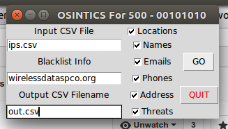
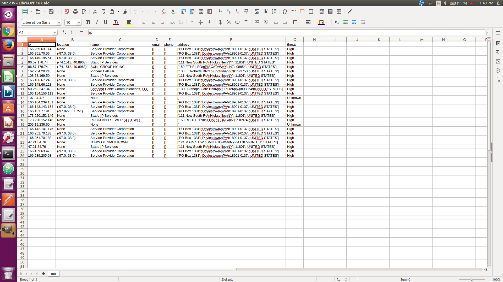
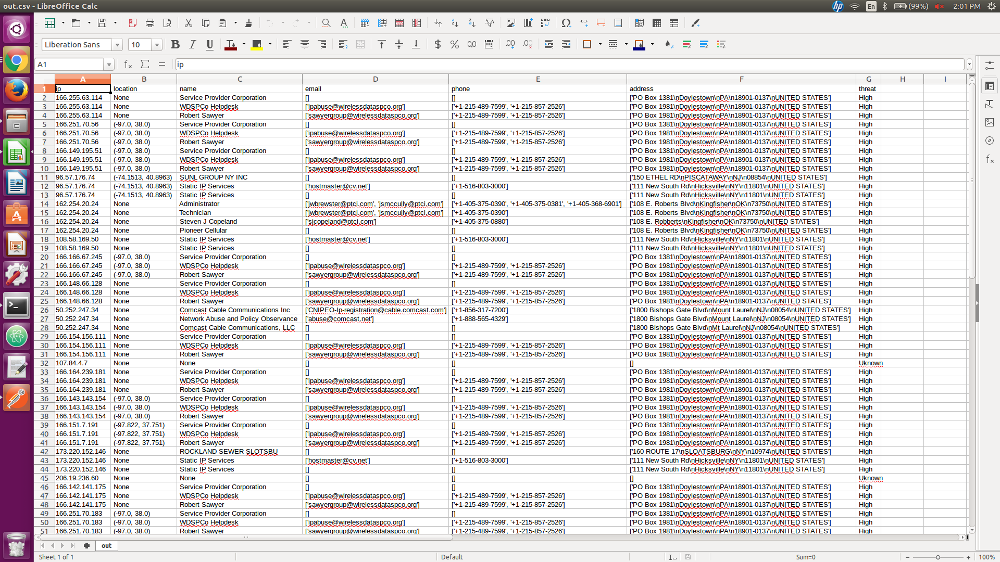

# IndustrialHack

## Objective

Find the GE-SRTP that are public and not secured correctly. Then find contact 
information for people using the non secure system. Then make list for future 
contact.

## How

There are a few different steps

1. Identify services with ports 18245 or 18246 open
2. Look for bytes /x01/x00... as a response (it is a GE-SRTP device)
3. Search ports for identifyable information
  * ensure that it is still running
  * check for other ips at the same location (up to 3 can be hosted on the same 
  device, if there is more than 3 then there are two devices)
  * check ports for identifyable services which include (for all ips):
   * ftp - 21
   * ssh - 22
   * telnet - 23
   * HTTP - 80
   * SSL/HTTPS - 443
4. Use this identifyable information to then look the person's contact 
information.
5. If no person can be found, then geo location can be used to attempt to 
identify the owner of the device.

## Implementation

Use python to search using apis such as Shodan and Censys.

### Required Libraries

The libraries that this needs to run are *censys*, to insatll: 'sudo pip3 install
censys'

### Step by step

1. This will probably use Shoden and export a list of ips that another module 
could use. These ips will all have the ports specified open (in this calse, 18245 
and 18246)

2. This is already taken care of by Shoden, although, if another attempt was 
made to use another search engine, this would then export a list of ips.

3. This takes a list of ips as an input. Then, this will search for identifyable 
information. This will be done using Censys.

  - First, check for other ips at the same location. (this could be done with 
  a hash map and maping by location).
  
  - Take the groups of ips with the same location. Check the person identifyed 
  at this location by one of the open services. The output is the list of names.
  
  - If no person name can be found use a company name if possible.
  
  - This will output a list of names.
  
4. Take this list of names and attempt to find contact info. This will also 
filter out large companies who would not own an industrial device such as 
phone companies.

5. If no contact info could be found, take the ips and then do a geo location 
search with some method.

### Human Example

First, we visited Shoden and used the GE-SRTP filter and US location. (1 and 2)

We then took the ips from this search and looked at open ports. (3)

We took these ports and ips and looked at censys to find any indentifyable 
information for a person or company. Filtering for cell phone companies. (4)

For the ones that a contact could not be found, we then searched for geo 
location using tools like traceroute and online services like google maps. (5)

## Usage

To use the project, you must have the required library and must have setup from 
censys in the censyskeys file. Then, run the file 'controller.py' with python3.

Image of the app running.

Image of filtered output.

Image of non-filtered output.

### Next steps

Initially before the user is able to use the program, they need to get the IP addresses
on their own through manual data entry, or via Api's of a certain search engine.

- The user needs to add their Censys key information into the censyskeys file

- Once the user has their CSV file they start up the program and type in the name of their CSV file 
in the Input CSV File text field (including extension). 

- The user can then select what output they would like in their output file by checking the Output boxes on the right, 
these categories include Location, Name, Emails, Phones, Address', and Threats. 

- The program then goes out to Censys and retrieves all the information about each 
individual IP that the website can provide.

- As of right now the location doesn't give the exact location of the SRTP machines, instead they
give a general area of where they might be. 

- A future implementation would be taking the IP address and finding all IP addresses in the same general area using Censys
and then determining IP's that are close and the company may be running an identifiable website on a local server.

- Threats are classified as what other ports or services are vulnerable or exposed on the device.  There can be multiple Names, Emails, 
Phones, and Addresses matched to each IP.  

- The blacklist email domain text field indicates which email domain you would like to ignore.  

- The output text area is for the user to specify what they would like to name their output file.
